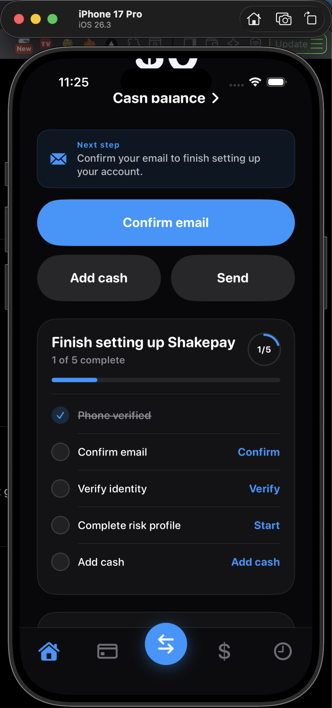
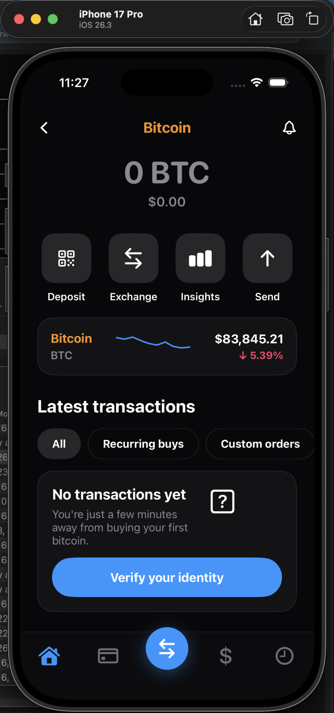
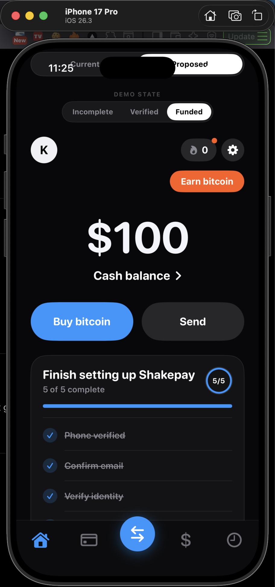
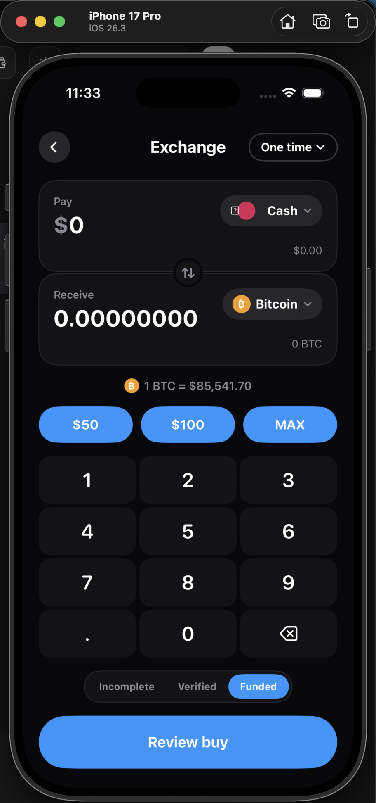
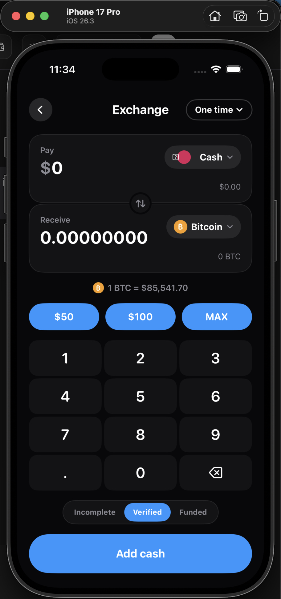

# Shakepay Design Exercise — UX Prototype

A front-end iOS prototype demonstrating **3 system-level UX improvements** to Shakepay's Home and first-click flows.

> **This is not a production app.** It is a prototype demonstrating how a single account-state model can improve clarity across Home and all first-click flows without visual redesign or feature expansion.

---

## Quick Start

> **View the prototype:** Open `shakepay-exercise.xcodeproj` in Xcode and run on iPhone 15 Pro simulator.

**Demo controls:** On the Proposed Home tab, use the segmented control to toggle between 3 account states:
- **Incomplete** — New user, nothing verified
- **Verified** — Identity complete, $0 balance  
- **Funded** — All ready, $100 balance

---

## Design Approach

### What This Is (and Isn't)

This is a **product-systems prototype**, not a visual redesign or feature expansion.

**What I didn't do:**
- Change Shakepay's colors, typography, or iconography
- Add new tabs or product features  
- Redesign the visual language
- Add backend integration or real payment processing

**What I did:**
- Identified a single shared state model (`AccountState`) as the intervention point
- Made all first-click screens respond to that state
- Removed cognitive interference during money actions

**Core principle:** "Clarity through state modeling, not visual polish."

### The Problem I Observed

In reviewing the current Shakepay app flow:

1. **Blockers discovered late** — Users can tap "Buy bitcoin" with $0 balance or unverified identity, only discovering the blocker inside the flow
2. **Setup state scattered** — Individual setup cards (Confirm email, Verify identity) appear as separate promotional interruptions rather than a unified account health indicator  
3. **Promotions interrupt task intent** — The recurring-buy promo appears on the one-time Exchange screen, the Card CTA always says "Get the Card" even when not eligible, and Payments opens with a blocking modal

### The Hypothesis

> If we make account state legible on Home and use it to drive all first-click screens, users will understand blockers before entering flows and complete tasks with less cognitive friction.

### The Intervention

Three changes, all derived from the same `AccountState` model:

| Change | What It Does | State Field(s) |
|--------|--------------|----------------|
| **1. Readiness Model** | Makes state **legible** | All fields |
| **2. State-Aware Actions** | Makes state **actionable** | `nextBestAction()` |
| **3. De-emphasize Promos** | Removes **interference** | Contextual gating |

### How the Changes Work Together

```
AccountState (single source of truth)
    │
    ├── Change 1: Home shows "2 of 5 complete" 
    │   (user sees what's blocking them)
    │
    ├── Change 2: Home CTA becomes "Confirm email" (not "Add / Send")
    │   (user can only take actions they're ready for)
    │
    ├── Change 3: Exchange doesn't show recurring promo during one-time buy
    │   (user completes tasks without promotional interruptions)
    │
    └── Result: User sees blockers early, enters only ready flows, 
        completes tasks without cognitive interference
```

### Proof: The Failure → Recovery Loop

The most important signal this prototype sends is the **end-to-end system working**:

1. **Try buy BTC** → blocked (no cash)
2. **Home shows "Add cash"** → tap it
3. **Interac e-Transfer** → $100 added to balance
4. **Home now shows "Buy bitcoin"** → tap it
5. **Exchange opens** → enter amount → confirm
6. **Success overlay** → Activity logs both transactions

This loop proves the state model is not just UI — it's a **working system** where state updates in one place propagate to all screens.

---

## The 3 Changes

### 1. Account Readiness Model (Home Only)

**Problem:** Setup and security prompts were scattered across the Home screen as a carousel of individual cards. Users could not see their overall account state in one place.

**Decision:** Replace the fragmented carousel with a single structured readiness card showing all setup steps, completion progress, and a clear "X of 5 complete" indicator.

**Tradeoff:** Removed individual setup cards from Home. The readiness card collapses to a compact success state when all steps are done, reducing visual noise for completed users.

**What it solves:** Users can see their overall account state in one place instead of discovering blockers late in flows.

**Key behaviors:**
- Shows 5 steps: Phone verified, Confirm email, Verify identity, Complete risk profile, Add cash
- Progress ring and bar update in real time
- Collapses to compact success state when all steps complete
- Each incomplete step has a direct action CTA

**File:** `Components/AccountReadinessCard.swift`

---

### 2. State-Aware Primary Actions

**Problem:** Home CTA was always "Add / Send" regardless of account state. Users could enter flows they couldn't complete (e.g., buying BTC with $0 balance or unverified identity).

**Decision:** The primary action adapts dynamically based on `AccountState` using a `nextBestAction()` priority function:

1. If `emailConfirmed` is false → "Confirm email"
2. Else if `identityVerified` is false → "Verify identity"  
3. Else if `riskProfileComplete` is false → "Complete risk profile"
4. Else if `cashBalance == 0` → "Add cash"
5. Else → "Buy bitcoin"

**Tradeoff:** The static "Add / Send" buttons are replaced by a dynamic CTA. This removes the familiar always-available "Add" button, but prevents users from entering blocked flows.

**What it solves:** Users don't enter blocked flows. The app surfaces the next required action instead of showing generic buttons.

**Key behaviors:**
- "Next step" card appears for blocking actions with contextual description
- Buttons are side-by-side (primary blue + secondary gray) matching Shakepay's pattern
- Transitions smoothly between states with animation

| State | Primary CTA | Secondary CTA |
|-------|-------------|---------------|
| Email not confirmed | **Confirm email** | Add cash · Send |
| Identity not verified | **Verify identity** | Add cash · Send |
| Risk profile incomplete | **Complete risk profile** | Add cash · Send |
| $0 cash balance | **Add cash** | Send |
| All ready | **Buy bitcoin** | Send |

**File:** `Components/StateAwareActionAreaView.swift`

---

### 3. De-emphasize Promotions During Task Intent

**Problem:** Promotional content interrupted core transaction flows. The recurring-buy promo banner sat on the main Exchange screen. The Card marketing CTA blocked task execution. Payments used a blocking modal on first open.

**Decision:** Keep promotional content, but move it out of core transaction paths:

- **Recurring buy promo** — moved to the Order Type Sheet only (not shown on main Exchange screen)
- **Card marketing CTA** — becomes state-aware: shows setup requirements when user is not eligible, shows "Get the Shakepay Card" when eligible
- **Payments modal** — removed entirely; replaced with an inline dismissible education card

**Tradeoff:** Promotional content is less visible on main screens. But task completion clarity is significantly improved because promotions no longer block or interrupt money actions.

**What it solves:** Reduces cognitive noise during money actions. Users can complete tasks without promotional interruptions.

| Element | Before | After |
|---------|--------|-------|
| Recurring buy promo | On main Exchange screen | Moved to Order Type Sheet only |
| Card marketing CTA | Always "Get the Card" | State-aware: shows requirements when not eligible |
| Payments first open | Blocking modal | Inline dismissible education card |

**Files:** `Flows/ExchangeView.swift` · `Tabs/CardView.swift` · `Tabs/PaymentsView.swift`

---

## Screenshots

### Home States (3 Variants)

The Proposed Home adapts to account state using the segmented control:

**Verified State (4/5 complete)**  
  
*Readiness card shows progress. "Add cash" is the primary CTA since identity is verified but balance is $0.*

**Funded State (5/5 complete)**  
  
*All setup complete. Primary CTA becomes "Buy bitcoin". Readiness card shows success state.*

**Incomplete State (1/5 complete)**  
  
*Email not confirmed. "Next step" card appears with "Confirm email" as primary action.*

---

### Current vs. Proposed Comparison

**Current Home**  
  
*Static "Add / Send" buttons regardless of state. Setup cards scattered as carousel.*

**Proposed Home**  
  
*State-aware CTA shows "Confirm email" with "Next step" context card. Readiness model consolidates all setup.*

---

### Exchange Flow

**Exchange Screen**  
  
*Clean one-time exchange. No recurring-buy promo on main screen. "Complete risk profile" CTA appears when needed.*

---

## System Architecture

### Single Source of Truth

All screens read from one shared state:

```swift
struct AccountState {
    var emailConfirmed: Bool
    var identityVerified: Bool
    var riskProfileComplete: Bool
    var cashBalance: Double
    var cardSetupComplete: Bool
    var securityUpgraded: Bool
}
```

### State-Driven UX Flow

```
AccountState
    ├── Home (Readiness Card + Actions)
    ├── Exchange (Balance check + Flow gating)
    ├── Card (Eligibility check)
    ├── Payments (Inline help)
    └── Activity (Transaction history)
```

### Demo State Presets

The prototype includes 3 preset states for demonstration:

| Preset | emailConfirmed | identityVerified | riskProfileComplete | cashBalance |
|--------|---------------|------------------|---------------------|-------------|
| **Incomplete** | ❌ | ❌ | ❌ | $0 |
| **Verified** | ✅ | ✅ | ✅ | $0 |
| **Funded** | ✅ | ✅ | ✅ | $100 |

Toggle between presets using the segmented control on the Proposed Home tab.

---

## User Flows

### Flow A: Setup Completion Loop

1. Home shows missing setup items in readiness card
2. User taps action CTA (e.g., "Confirm" for email)
3. Setup flow screen opens
4. User completes step → state updates
5. Home updates in real time → readiness card reflects progress
6. When all complete, card collapses to success state

### Flow B: Add Cash → Unlock Transaction

1. User has $0 balance → Home shows "Add cash" as primary CTA
2. User taps "Add cash" → AddCashView opens
3. User selects Interac e-Transfer → $100 added to balance
4. Home updates → CTA changes to "Buy bitcoin"
5. User can now enter Exchange and complete a buy

### Flow C: Buy Crypto Success Loop

1. Enter Exchange with sufficient cash
2. Enter amount → Review buy
3. Confirm → Success overlay
4. Cash balance decreases
5. Transaction appears in Activity

---

## Project Structure

```
shakepay-exercise/
├── shakepay-exercise/
│   ├── AccountState.swift          # Data model + next best action logic
│   ├── Models.swift                # Supporting types
│   ├── Theme.swift                 # Colors, typography
│   ├── App.swift                   # App entry point
│   ├── RootView.swift              # Tab container
│   ├── HomeView.swift              # Current (original) Home
│   ├── ProposedHomeView.swift      # Proposed Home with 3 changes
│   ├── Components/
│   │   ├── AccountReadinessCard.swift      # Change 1
│   │   ├── StateAwareActionAreaView.swift  # Change 2
│   │   └── ... other components
│   ├── Flows/                      # Flow screens
│   │   ├── AddCashView.swift
│   │   ├── SendView.swift
│   │   └── ...
│   └── Tabs/                       # Tab screens
│       ├── CardView.swift          # Change 3
│       ├── PaymentsView.swift      # Change 3
│       └── ActivityView.swift
├── docs/
│   ├── 3_CHANGES.md               # Detailed breakdown
│   ├── SYSTEM_MAP.md              # Architecture
│   └── DESIGN_DECISIONS.md        # What was removed and why
└── README.md                       # This file
```

---

## Tech Stack

- **Platform:** iOS 17.0+
- **Framework:** SwiftUI
- **Build Tool:** XcodeGen (`project.yml`)
- **No external dependencies**

---

## Running the Prototype

### Requirements
- Xcode 15.0+
- iOS 17.0+ Simulator or device

### Steps

1. Clone the repository:
   ```bash
   git clone https://github.com/kurosh87/sp-exercise.git
   cd sp-exercise
   ```

2. Generate the Xcode project:
   ```bash
   xcodegen generate
   ```

3. Open `shakepay-exercise.xcodeproj` in Xcode

4. Build and run on iPhone 15 Pro simulator

---

## Design Decisions

### What Was Removed

- **Fragmented setup carousel** → Single readiness card
- **Static "Add / Send" buttons** → Dynamic state-aware CTA
- **Blocking Payments modal** → Inline education card
- **Recurring buy promo on Exchange main** → Moved to Order Type Sheet
- **Generic Card CTA** → State-aware eligibility check

### What Was Preserved

- Shakepay's dark theme, blue accent, card backgrounds
- Existing tab structure (Home, Card, Exchange, Payments, Activity)
- Visual language and typography system
- Current vs. Proposed toggle for comparison

### Why System > UI

The evaluation criteria are **systems thinking, judgment, and tradeoffs** — not UI craft. Every visual decision serves the state model.

### Scope Control

To maintain 2-week feasibility, these were explicitly excluded:

- Backend integration or real payment processing
- Crypto wallet functionality
- Push notifications
- Analytics or tracking
- Multiple competing Home variants
- Unit tests (prototype only)

---

## Key Insight

> "I didn't redesign Shakepay. I introduced a single account-state model that improves clarity across Home and all first-click flows."

The 3 changes work together as a system:
1. **Readiness Model** makes account state legible
2. **State-Aware Actions** prevents users entering blocked flows
3. **De-emphasized Promotions** reduces cognitive interference during money actions

All three are driven by the same `AccountState` model, creating a coherent experience where updating state in one place updates all screens.

---

## License

This is a design exercise prototype. Not for production use.
